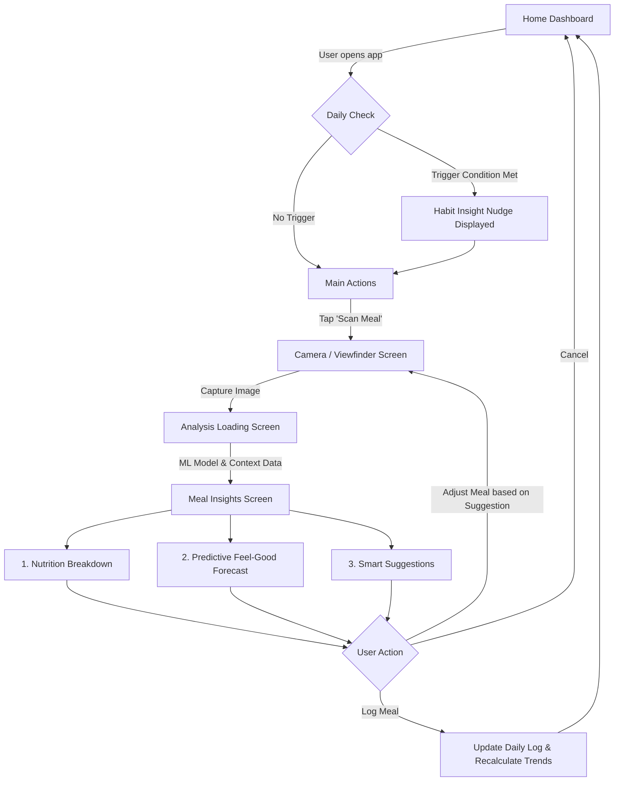

# NutriLens - Product Workflow & Screen Specifications
**Product Vision:** A proactive food and health application leveraging computer vision and behavioral analytics to guide users toward better nutritional choices in real-time.

---

## High-Level Workflow Diagram (Mermaid)

## Detailed Screen-by-Screen Specifications (for Google Stitch)

### 1. Home Dashboard
The central hub focusing on today's progress, quick actions, and proactive habit nudges.
* **Top Bar:** User greeting, current streak, and profile avatar.
* **Hero Section - Habit Insight Nudge (Feature 2):** * **UI State:** A dismissible, softly colored card (e.g., pastel yellow or blue) that stands out from standard logs.
  * **Logic:** Engine checks the last 7 days of logged data. If a negative pattern is detected (e.g., high sugar at 3 PM, low protein at breakfast), display a nudge.
  * **Copy Example:** "Insight: You’ve had high-sugar snacks 3 times this week around 3 PM. Tomorrow, try swapping the candy for an apple to avoid the 4 PM crash."
  * **Action:** "Set Reminder" or "Dismiss".
* **Primary Call to Action (FAB):** A large, visually distinct floating action button or bottom-center tab labeled "Scan Meal" with a camera icon.
* **Daily Summary Ring:** Visual rings showing Calories, Protein, Carbs, and Fats consumed vs. goals.

### 2. Camera & Scanning Viewport
Frictionless entry point for meal logging.
* **Viewfinder:** Full-screen camera feed.
* **Overlays:** Corner brackets indicating the focus area.
* **Interactive Elements:** Flash toggle, gallery upload option, and a large circular shutter button.
* **Feedback:** Real-time bounding boxes with subtle animations attempting to auto-detect items before the shutter is pressed (e.g., "Apple detected", "Bowl of pasta detected").

### 3. Processing State (The "Magic" Loading Screen)
Builds trust by showing the user that complex analysis is happening.
* **Visual:** The captured image freezes, darkens slightly, and a scanning line (laser effect) moves up and down.
* **Dynamic Text:** Flashing sequential copy: "Identifying ingredients..." -> "Calculating macros..." -> "Analyzing historical impact..." -> "Generating forecast..."

### 4. Meal Insights & Action Screen
The core value-delivery screen containing Features 1 and 3. Divided into distinct, scrollable cards.

**Card A: Identified Items & Nutrition Breakdown (Feature 1a)**
* **UI Elements:** A list of detected items with thumbnail crops from the main image.
* **Data Points:** Total Calories, Protein (g), Carbs (g), Fats (g), and Sugar (g).
* **Controls:** Ability to manually adjust portion sizes (slider or +/- buttons) or delete incorrect items.

**Card B: Predictive "Feel-Good" Forecasting (Feature 3)**
* **UI Elements:** A dynamic timeline graphic or a mood gauge (e.g., a dial from 'Sluggish' to 'Energized').
* **Data Logic:** Cross-references the meal's glycemic index, macro balance, and user's historical responses.
* **Output States:**
  * **State 1 (High Sugar/Low Fiber):** "📉 Sugar Crash Alert: You'll likely feel a sharp energy drop in about 90 minutes."
  * **State 2 (Balanced/High Protein):** "🔋 Stable Energy: This meal provides sustained fuel for the next 3-4 hours."
  * **State 3 (Heavy/High Fat):** "🥱 Sluggishness Predicted: High fat content might make you feel lethargic soon."

**Card C: Smart Suggestions (Feature 1b)**
* **UI Elements:** "Optimize Your Meal" drawer or highlighted suggestion boxes.
* **Logic:** Triggered if Card B predicts a negative outcome or if the meal breaks daily macro limits.
* **Examples:**
  * *Scenario:* User scanned a plate of plain pasta.
    * *Suggestion:* "Add a side of grilled chicken or broccoli to lower the glycemic spike and stay full longer."
  * *Scenario:* Scan shows a large fast-food burger.
    * *Suggestion:* "Consider saving half for later to keep your daily saturated fat within healthy limits."
* **Actions:** "Accept & Remind Me Next Time" or "Log As Is".

### 5. Log Confirmation & Celebration
* **Animation:** A delightful checkmark animation. Confetti if a daily goal is perfectly met or a positive habit nudge is successfully acted upon.
* **Routing:** Returns user to the updated Home Dashboard.

## Data Architecture & Logic Hooks (For Dev Handoff)
* **Image Recognition API:** Needs endpoints for object detection, volume estimation (using depth data if available), and mapping to the nutritional database.
* **Habit Engine:** A chron job running nightly that parses user_id logs, clustering high-sugar/high-fat events by time of day to generate the Habit_Nudge payload for the next day.
* **Forecast Engine:** A rules-based algorithm (v1) evaluating Total_Sugar, Fiber_Ratio, and Protein_Ratio to output an Energy_Curve string to the front end.